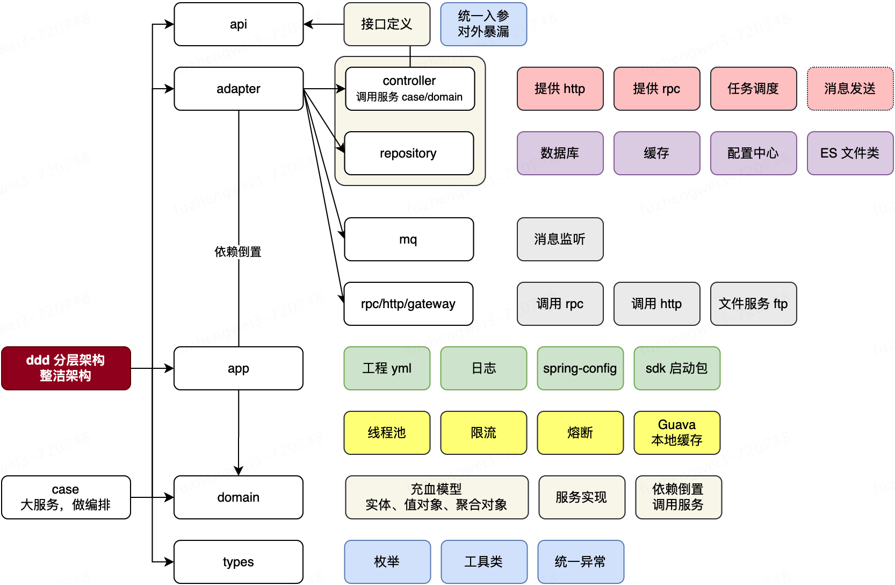
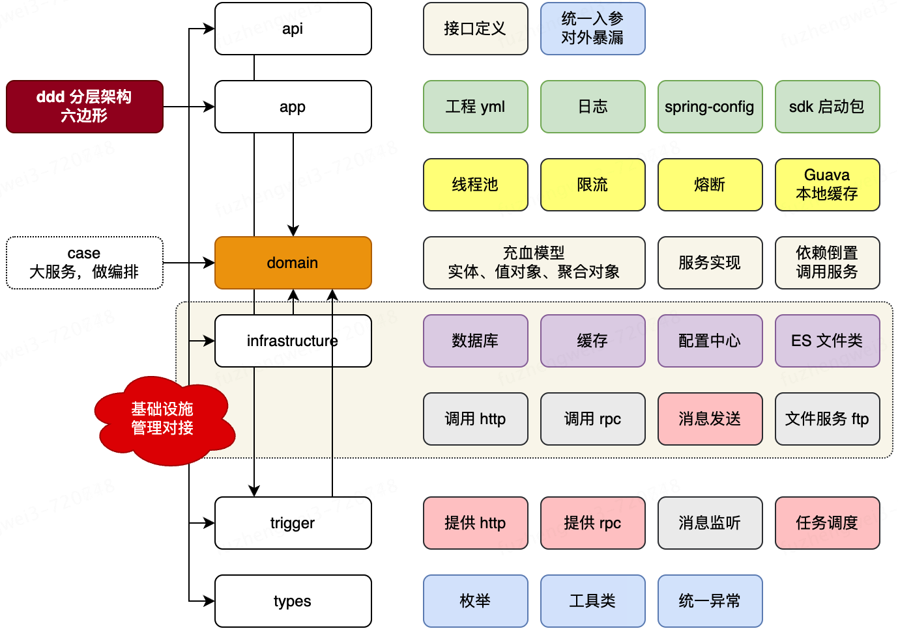

# Shopping Mall DDD 工程结构设计对比

本文对比两种常见的 DDD 工程结构设计：

- DDD 分层架构：整洁架构风格
- DDD 分层架构：六边形架构风格

当前项目采用 Maven 多模块组织，模块职责与图中的抽象命名大致对应如下：

| 当前项目模块 | 图中抽象模块 | 主要职责 |
| --- | --- | --- |
| `s-pay-mall-api` | `api` | 对外接口定义、DTO、RPC/Feign 契约 |
| `s-pay-mall-application` | `app` | 应用服务、用例编排、事务控制 |
| `s-pay-mall-domain` | `domain` | 领域模型、聚合、值对象、领域服务、仓储接口 |
| `s-pay-mall-infrustracture` | `infrastructure` / `adapter` | 数据库、缓存、MQ、第三方接口、仓储实现等基础设施适配 |
| `s-pay-mall-trigger` | `trigger` / `adapter` | HTTP Controller、MQ Listener、任务调度等外部入口 |
| `s-pay-mall-common` | `types` | 通用枚举、工具类、统一异常、通用返回对象 |

> 说明：项目中的 `s-pay-mall-infrustracture` 命名疑似拼写为 `infrustracture`，通常建议命名为 `infrastructure`。

## 方案一：DDD 分层架构，整洁架构



### 结构特点

整洁架构强调由外向内依赖，核心业务位于最内层，外层模块围绕核心业务提供入口、编排和技术适配。

典型模块职责如下：

| 模块 | 职责 |
| --- | --- |
| `api` | 定义对外暴露的接口契约，例如 RPC 接口、HTTP DTO、统一入参和出参 |
| `adapter` | 适配外部系统和技术实现，例如 Controller、Repository 实现、MQ、RPC、HTTP、网关、文件服务 |
| `app` | 应用层，负责业务用例编排、事务边界、调用领域服务和仓储接口 |
| `domain` | 领域层，承载核心业务模型，例如实体、值对象、聚合、领域服务、领域事件 |
| `types` | 通用基础类型，例如枚举、工具类、统一异常、通用返回对象 |

在这种结构中，`adapter` 的职责比较宽，既可能包含入站适配器，也可能包含出站适配器：

- 入站适配：HTTP Controller、RPC Provider、任务调度、消息监听
- 出站适配：数据库、缓存、配置中心、RPC Client、HTTP Client、文件服务、消息发送

### 设计原理

整洁架构的核心思想是“依赖倒置”和“业务核心稳定”。

领域层不依赖数据库、缓存、MQ、Web 框架等技术细节。应用层通过领域层暴露的接口完成用例编排，基础设施层再去实现这些接口。

推荐依赖方向：

```text
api/types -> 被其他模块引用
trigger/controller -> app -> domain
adapter/infrastructure -> domain
app -> domain
domain -> types
```

其中最重要的是：

```text
domain 不依赖 infrastructure
domain 不依赖 trigger
domain 不依赖 controller
```

例如，领域层只定义仓储接口：

```text
s-pay-mall-domain
└── repository
    └── PayOrderRepository
```

基础设施层负责实现：

```text
s-pay-mall-infrastructure
└── repository
    └── PayOrderRepositoryImpl
```

应用层只面向接口编排业务：

```text
s-pay-mall-application
└── service
    └── PayOrderApplicationService
```

### 优点

- 分层清晰，比较符合 Java 后端团队常见认知，学习成本较低。
- 核心领域模型被保护在 `domain` 中，不容易被 Web、DB、MQ 等技术细节污染。
- `app` 层适合承载复杂用例编排，例如支付、订单、营销、库存之间的协作。
- `api` 模块可以单独给其他服务依赖，适合微服务间接口共享。
- 对传统三层架构改造较友好，可以逐步从 `controller -> service -> mapper` 演进过来。

### 缺点

- `adapter` 容易变得过大，因为入站和出站适配都放在一起。
- 如果团队边界意识不强，`app` 层容易退化成“大 Service”，领域层只剩贫血模型。
- `types/common` 容易被滥用，业务枚举和业务对象可能被错误放入公共模块。
- 依赖关系需要严格约束，否则很容易出现 `domain` 反向依赖基础设施的情况。

## 方案二：DDD 分层架构，六边形架构



### 结构特点

六边形架构又叫 Ports and Adapters Architecture。它比整洁架构更强调“端口”和“适配器”的边界。

核心业务仍然位于中心，但会更明确地区分：

- 入站适配器：外部如何调用系统
- 出站适配器：系统如何调用外部资源

典型模块职责如下：

| 模块 | 职责 |
| --- | --- |
| `api` | 对外接口定义，作为统一入参、出参和暴露契约 |
| `app` | 应用服务，承载 use case，负责流程编排 |
| `domain` | 核心领域模型，包含聚合、实体、值对象、领域服务 |
| `infrastructure` | 出站基础设施适配，例如数据库、缓存、配置中心、ES、HTTP Client、RPC Client、消息发送、文件服务 |
| `trigger` | 入站触发器，例如 HTTP、RPC、MQ 监听、任务调度 |
| `types` | 基础通用类型，例如枚举、工具类、统一异常 |

与第一种方案相比，六边形架构把 `trigger` 和 `infrastructure` 拆得更明确：

```text
trigger        负责外部请求进入系统
infrastructure 负责系统访问外部资源
```

也就是说：

- `trigger` 是 driving adapter，驱动系统执行用例
- `infrastructure` 是 driven adapter，被系统调用以完成技术能力

### 设计原理

六边形架构的核心思想是：应用和领域不关心外部世界的具体形态，只关心端口。

外部调用系统时：

```text
HTTP/RPC/MQ/Job -> trigger -> app -> domain
```

系统调用外部资源时：

```text
app/domain -> port interface -> infrastructure -> DB/Redis/MQ/HTTP/RPC
```

其中 port 一般表现为接口，例如：

```text
PayOrderRepository
PaymentGateway
InventoryClient
MessagePublisher
```

这些接口可以放在 `domain` 或 `application` 中，具体取决于它们是否属于领域概念：

- 领域需要感知的仓储接口，通常放 `domain.repository`
- 纯应用编排需要的外部能力接口，可以放 `application.port`
- 技术实现统一放 `infrastructure`

例如：

```text
s-pay-mall-domain
└── repository
    └── PayOrderRepository

s-pay-mall-application
└── port
    └── PaymentGateway

s-pay-mall-infrastructure
├── persistence
│   └── PayOrderRepositoryImpl
└── client
    └── AlipayPaymentGateway
```

这样做的结果是，业务核心不直接依赖支付宝 SDK、MyBatis、Redis、RocketMQ，而是依赖抽象端口。

### 优点

- 入站和出站适配器边界更清楚，模块职责比整洁架构更细。
- 非常适合多入口系统，例如同时提供 HTTP、RPC、MQ 消费、定时任务。
- 非常适合多外部资源系统，例如同时接入数据库、缓存、配置中心、第三方支付、消息队列、文件服务。
- 更容易做单元测试，可以通过 mock port 来测试 application/domain。
- 更符合 DDD 中“领域模型独立于技术细节”的原则。

### 缺点

- 结构比普通分层更复杂，团队需要理解端口、适配器、依赖倒置等概念。
- 接口数量会增加，小项目可能显得偏重。
- 如果拆分过细，可能出现大量 `port`、`adapter`、`converter` 类，增加维护成本。
- 对包命名和依赖约束要求更高，否则容易变成“目录很多，但边界不清”的伪 DDD。

## 两种方案核心对比

| 对比项 | 整洁架构 | 六边形架构 |
| --- | --- | --- |
| 核心目标 | 保护业务核心，控制依赖方向 | 通过端口隔离内外部系统 |
| 模块组织 | 更偏传统分层 | 更偏端口和适配器 |
| 入站入口 | 通常放在 `adapter` 或 `trigger` | 明确放在 `trigger` |
| 出站资源 | 通常放在 `adapter` 或 `infrastructure` | 明确放在 `infrastructure` |
| 领域层定位 | 核心业务模型 | 核心业务模型 |
| 应用层定位 | 用例编排、事务控制 | 用例编排、调用端口 |
| 复杂度 | 中等 | 较高 |
| 适合项目 | 中小型到中大型业务系统 | 中大型、多入口、多外部依赖系统 |
| 风险点 | `adapter` 和 `app` 容易变胖 | 抽象过多，落地成本较高 |

## 当前项目更适合哪一种

从当前模块来看：

```text
s-pay-mall-api
s-pay-mall-application
s-pay-mall-domain
s-pay-mall-infrustracture
s-pay-mall-trigger
s-pay-mall-common
```

它更接近第二种“六边形架构”：

- `trigger` 已经单独拆出，适合承载 HTTP、RPC、MQ 监听、任务调度等入站入口。
- `infrustracture` 已经单独拆出，适合承载数据库、缓存、第三方接口、MQ 发送等出站适配。
- `application` 和 `domain` 分离，说明项目希望区分“用例编排”和“领域模型”。
- `api` 独立存在，适合对外暴露统一契约。
- `common` 类似图中的 `types`，适合放通用基础类型。

因此，当前项目建议按六边形架构继续收敛：

```text
trigger -> application -> domain
application -> domain
infrastructure -> application/domain 中定义的 port
api/common -> 作为基础契约和通用类型被引用
```

需要重点避免：

- 在 `domain` 中引入 MyBatis、JPA、Redis、MQ、HTTP、Spring MVC 等技术细节。
- 把业务状态枚举全部放进 `common`，例如 `OrderStatus`、`PayStatus` 应该优先放到对应领域中。
- 在 `application` 中堆积全部业务判断，导致 `domain` 只剩 getter/setter。
- 让 `trigger` 直接调用 `infrastructure`，绕过应用层用例编排。

## 推荐包结构

以支付商城为例，可以采用如下结构：

```text
s-pay-mall-trigger
└── cn.xxx.paymall.trigger
    ├── http
    ├── rpc
    ├── mq
    └── job

s-pay-mall-application
└── cn.xxx.paymall.application
    ├── service
    ├── command
    ├── query
    ├── assembler
    └── port

s-pay-mall-domain
└── cn.xxx.paymall.domain
    ├── order
    │   ├── model
    │   ├── repository
    │   ├── service
    │   └── event
    ├── pay
    │   ├── model
    │   ├── repository
    │   ├── service
    │   └── event
    └── product

s-pay-mall-infrastructure
└── cn.xxx.paymall.infrastructure
    ├── persistence
    ├── cache
    ├── mq
    ├── client
    └── config

s-pay-mall-api
└── cn.xxx.paymall.api
    ├── dto
    └── service

s-pay-mall-common
└── cn.xxx.paymall.common
    ├── enums
    ├── exception
    ├── result
    └── utils
```

## 总结

整洁架构更适合作为 DDD 分层的入门落地方案，它强调分层清晰、依赖向内、业务核心稳定。

六边形架构更适合当前这类支付商城项目，因为它能更清楚地区分外部入口和基础设施适配，尤其适合同时存在 HTTP、RPC、MQ、任务调度、数据库、缓存、第三方支付等多种技术连接点的系统。

如果项目规模较小，可以先按整洁架构控制复杂度；如果项目会持续演进，并且外部系统依赖较多，建议按六边形架构严格约束模块职责和依赖方向。
